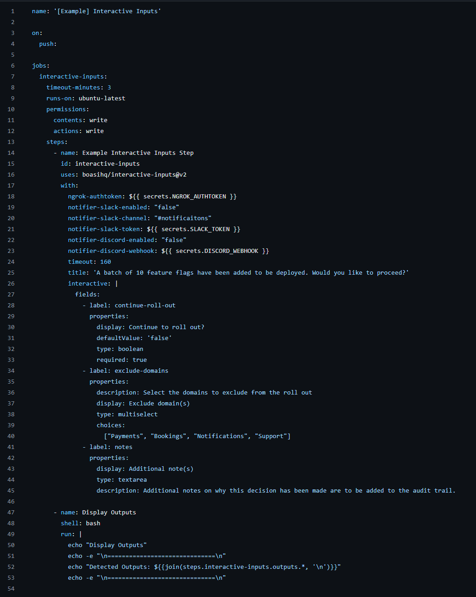

# Interactive Inputs

Supercharge your GitHub Action workflows! Adding **Interactive Inputs** allows you to create dynamic workflows that adapt to user input.

## Summary

This action allows you to create interactive inputs in your GitHub Actions workflows. Interactive inputs are a powerful way to create dynamic workflows that adapt to user input.

It was created to solve the problem of GitHub Actions needing a core feature such as in-workflow inputs like its counterparts such as Jenkins, where you can make an in-pipeline input that will prompt the user during runtime for input and then use that input in the workflow.

<!-- action-docs-inputs source="action.yml" -->
## Inputs

| name | description | required | default |
| --- | --- | --- | --- |
| `title` | <p>The title of the interactive inputs form</p> | `false` | `""` |
| `interactive` | <p>The representation (in yaml) of fields to be displayed. See https://github.com/boasiHQ/interactive-inputs?tab=readme-ov-file#input-fields-types for more information</p> | `true` | `fields:   - label: random-string     properties:       display: Enter a random string       type: text       description: A random string up to 20 characters long       maxLength: 20       required: false   - label: choice     properties:       display: Select a monitoring tool       type: select       description: Available options to chose from       choices: ["datadog", "sentry", "grafana"]       required: true ` |
| `timeout` | <p>The timeout in seconds for the interactive inputs form</p> | `false` | `300` |
<!-- action-docs-inputs source="action.yml" -->

To see the full list of supported input fields for the `interactive` input, see the [Input Fields Types](#input-fields-types) section below.

### Screenshots

Here are some screenshots of the Interactive Input action... in action 👀😔:




## Getting Started

To get started, there are three main steps:

1. Sign up to NGROK and get your auth token if you do not already have one by [**clicking here**](https://dashboard.ngrok.com/signup)
2. Add this action `boasiHQ/interactive-inputs@v1` to your workflow file. See [the example below](#example) for more information.
3. Use the predictable output variables from your interactive input portal to create dynamic workflows.

> Note, this action requires an ARM64 or AMD64 (x86) runner to run i.e. `ubuntu-latest`

## Example

To get started, below is an example of how you can leverage this action in your workflow file:

```yaml
name: '[Example] Interactive Inputs'

on:
  push:

jobs:
  interactive-inputs:
    timeout-minutes: 3
    runs-on: ubuntu-latest
    permissions:
      contents: write
      actions: write
    env:
      NGROK_AUTHTOKEN: ${{ secrets.NGROK_AUTHTOKEN }}
      GITHUB_TOKEN: ${{ secrets.GITHUB_TOKEN }}
    steps:
      - name: Example Interactive Inputs Step
        id: interactive-inputs
        uses: boasiHQ/interactive-inputs@v1
        with:
          timeout: 160
          title: 'A batch of 10 feature flags have been added to be deployed. Would you like to proceed?'
          interactive: |
            fields:
              - label: continue-roll-out
                properties:
                  display: Continue to roll out?
                  defaultValue: 'false'
                  type: boolean
                  required: true
              - label: exclude-domains
                properties:
                  description: Select the domains to exclude from the roll out
                  display: Exclude domain(s)
                  type: multiselect
                  choices: 
                    ["Payments", "Bookings", "Notifications", "Support"]
              - label: notes
                properties:
                  display: Additional note(s)
                  type: textarea
                  description: Additional notes on why this decision has been made are to be added to the audit trail.

      - name: Display Outputs
        shell: bash
        run: |
          echo "Display Outputs"
          echo -e "\n==============================\n"
          echo "Detected Outputs: ${{join(steps.interactive-inputs.outputs.*, '\n')}}"
          echo -e "\n==============================\n"
```         

### Key points

When using this action, here are a few key points to note:

- The portal will display fields in the order defined in the `fields` array.
- The `label` property is used to identify the input field and its corresponding output. For example, the `label` property in the `fields` array for **Continue to roll out?** is `continue-roll-out`. This means that the output will be stored in a variable called `continue-roll-out`, which can be accessed using the syntax `${{ steps.interactive-inputs.outputs.continue-roll-out }}`.
- The env `NGROK_AUTHTOKEN` and `GITHUB_TOKEN` authenticate the request to the Ngrok API and the GitHub API, respectively. Both are needed to be set in the workflow file.
  - Signing up for NGROK is free and quick; it can be done [here](https://dashboard.ngrok.com/signup).
- There are various [types of input fields](#input-fields-types) that can be used, [**vist the input fields types**](#input-fields-types) in this README for more information.
- The `timeout` property sets the timeout for the interactive input. The workflow will fail if the user does not respond within the timeout period.


## Input Fields Types

The input fields shape the user interface of the interactive input. The input fields are defined in the `fields` property of the `interactive` attribute of the `with` object.

```yaml
      ...
      - name: Example Interactive Inputs Step
        id: interactive-inputs
        uses: boasiHQ/interactive-inputs@v1
        with:
          ...
          interactive: |
            fields:
              - label: continue-roll-out
                properties:
                  display: Continue to roll out?
                  ...
```

The `fields` property is an array of objects, each object representing a field. Each field type has its properties, some unique to the particular field type. See below the supported field types and their respective properties.

### Text Input - `text`

The text input field is used to capture text input from the user. It is the most commonly used input field type.

#### Example

```yaml
fields:
 - label: name # Required
    properties:
      display: Name # Optional: if not specified, the title for the field will not be displayed on the portal
      type: text # Required
      description: The name of the user # Optional: If not added, "i" won't be on the portal for the field
      required: true # Optional: If not added, will default to `false`
      maxLength: 20 # Optional: If not added, the user will not have a limit
      placeholder: Enter your name # Optional: If not added, the placeholder won't be displayed on the portal
      defaultValue: John Doe # Optional: If not added, the default value won't be displayed on the portal
```
### Textarea Input - `textarea`

The textarea input field is used to capture or display ( set `readOnly` to `true`) multi-line text input from the user. It is commonly used to capture long text input from the user.

> Note, when set to `readOnly` true, the data will still be stored in the output variable, but the user cannot change the value.

#### Example

```yaml
fields:
 - label: notes # Required
    properties:
      display: Additional note(s)  # Optional
      type: textarea # Required
      description: Additional notes on this decision  # Optional
      required: false  # Optional
      maxLength: 200  # Optional
      placeholder: Enter your notes  # Optional
      defaultValue: This is a note  # Optional
      readOnly: false # Optional: If not added, will default to `false`. If set to `true` the field will be read-only, and the user will not be able to change the value, which can be useful for displaying information to the user. 
```

### Number Input - `number`

The number input field is used to capture numerical input from the user.

#### Example

```yaml
fields:
 - label: cache-wipe-days # Required
    properties:
      display: Wipe cache data by (days)  # Optional
      type: number # Required
      description: The number of days to wipe cache the data for  # Optional
      required: true  # Optional
      minNumber: 0  # Optional: This is the minimum number that the user can enter
      maxNumber: 17  # Optional: This is the maximum number that the user can enter
      placeholder: Enter the number of days to wipe cache data # Optional
      defaultValue: 14  # Optional: This is the value that will be displayed on the portal and used for the output if the user enters no value
```

### Boolean Input - `boolean`

The boolean input field captures a boolean input from the user (`True` or `False`). It is commonly used to determine where the expected output should be `True` or `False` from the user.

#### Example

```yaml
fields:
 - label: use-interactive-inputs # Required
    properties:
      display: Should you use Interactive Inputs? # Optional
      type: boolean # Required
      description: Whether you should use Interactive Inputs in your workflows # Optional
      defaultValue: true # Optional: If not added, neither True nor False will be selected on the portal
```

### Select Input - `select`

The select input field captures a single selection from a list of options from the user. It is commonly used to capture when you wish to scope the user's choice for a particular set of options.

> Note, the `choices` property can be represented as a hyphenated list of strings (shown in the example below) or also an array of strings, i.e. `["US", "UK", "DE", "FR", "JP"]`.

#### Example

```yaml
fields:
 - label: country-rate-limit # Required
    properties:
      display: Which country should have a limited request rate? # Optional
      type: select # Required
      description: The country that should have requests for unregistered users rate limited # Optional
      required: false # Optional
      choices: # Required: This is the list of options the user can select. It can be generated by a previous step or a static list of options.
        - US
        - UK
        - DE
        - FR
        - JP
```

### Multi-Select Input - `multiselect`

The multi-select input field captures multiple selections from a list of user options. It is commonly used to capture when you wish to scope the user's selection for a particular set of options.

> Note, the `choices` property can be represented as a hyphenated list of strings (shown in the example below) or also an array of strings, i.e. `["US", "UK", "DE", "FR", "JP"]`.

#### Example

```yaml
fields:
 - label: countries-to-rate-limit # Required
    properties:
      display: Which countries should have a limited request rate? # Optional
      type: multiselect # Required
      description: The countries that should have requests for unregistered users rate limited # Optional
      required: false # Optional
      choices: # Required: This is the list of options the user can select. It can be generated by a previous step or a static list of options.
        - US
        - UK
        - DE
        - FR
        - JP
```


## 💻 Contributing, 🐛 Reporting Bugs & 💫 Feature Requests

We are currently developing a process to facilitate contributions. Please be patient with us! In the meantime, please create an issue if you would like to request additional features, report any unexpected behaviour, or provide any other feedback.

Soon, we will use issues to gather feedback on bugs, feature requests, and more. When testing new features or bug fixes, we will create pull requests (PRs) and keep them focused on a single feature or bug fix, allowing you to test them.

When expressing interest in a bug, enhancement, PR, or issue, please use the thumbs-up or thumbs-down emoji on the original message rather than adding duplicate comments.


## Licence

MIT License - see [LICENSE.md](LICENSE.md) for details